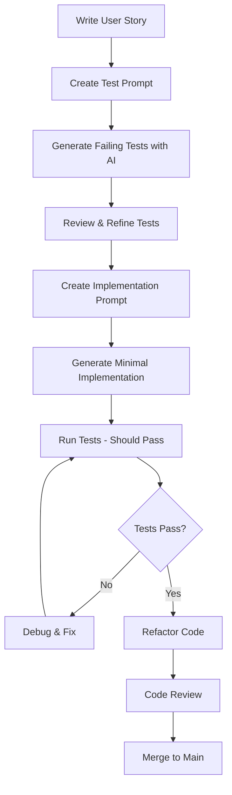

# ADR-010: AI-Driven Test-First Development

**Status**: Accepted  
**Date**: 2025-08-15  
**Deciders**: Development Team, Tech Lead, QA Team  

## Context

The Student Accommodation System development team wants to leverage AI assistance while maintaining high code quality and test coverage. Traditional Test-Driven Development (TDD) has proven benefits for code quality, but can be time-consuming. We need to establish a workflow that:

1. Maintains the benefits of TDD (better design, higher test coverage, fewer bugs)
2. Leverages AI to accelerate development without compromising quality
3. Ensures consistency across team members when using AI tools
4. Maintains code review standards for AI-generated code
5. Provides measurable quality metrics for AI-assisted development

The team has varying levels of experience with both TDD and AI-assisted development, requiring standardized processes and templates.

## Decision

We will implement an **AI-Driven Test-First Development** workflow that combines the rigor of Test-Driven Development with the efficiency of AI code generation.

### Core Principles:

1. **Tests Before Implementation**: Always write tests first, whether manually or AI-assisted
2. **AI-Generated Tests Must Be Reviewed**: All AI-generated test code requires human review
3. **Standardized Prompts**: Use team-approved prompt templates for consistency
4. **Red-Green-Refactor**: Maintain traditional TDD cycle with AI assistance
5. **Quality Gates**: Automated checks ensure AI-generated code meets standards

### Workflow Process:

### Implementation Strategy:

1. **Prompt Templates**: Standardized templates for test generation and implementation
2. **Quality Checklist**: Mandatory checklist for AI-generated code review
3. **Automated Testing**: CI/CD pipeline validates test coverage and code quality
4. **Peer Review**: All AI-generated code goes through peer review process
5. **Metrics Tracking**: Monitor effectiveness of AI-assisted vs manual development

### Tools and Standards:

- **AI Tools**: GitHub Copilot, ChatGPT, Claude (team-standardized versions)
- **Test Frameworks**: Jasmine/Karma (Angular), JUnit 5/Mockito (Spring Boot)
- **Coverage Tools**: SonarQube for code coverage and quality metrics
- **Prompt Library**: Version-controlled repository of approved prompt templates

## Consequences

### Positive
- **Accelerated Development**: AI assists in generating boilerplate tests and implementations
- **Consistent Quality**: Standardized prompts ensure consistent code patterns across team
- **Better Test Coverage**: TDD approach with AI assistance can achieve higher coverage
- **Knowledge Sharing**: Prompt templates share best practices across team members
- **Reduced Bugs**: Test-first approach catches issues early in development cycle
- **Learning Acceleration**: Junior developers learn TDD patterns through AI-guided examples
- **Documentation**: AI can generate test documentation and examples
- **Refactoring Safety**: Comprehensive test suites enable confident refactoring

### Negative
- **Initial Setup Overhead**: Time required to create prompt templates and establish workflow
- **AI Dependency**: Risk of over-reliance on AI for problem-solving
- **Code Review Burden**: All AI-generated code requires thorough human review
- **Prompt Maintenance**: Templates need regular updates as requirements evolve
- **Learning Curve**: Team needs training on effective prompt engineering
- **Quality Variance**: AI output quality depends on prompt quality and context
- **Tool Costs**: Some AI tools require paid subscriptions or API usage costs

### Neutral
- **Workflow Adjustment**: Team needs to adapt existing development processes
- **Tool Standardization**: Need to standardize on specific AI tools and versions
- **Metrics Evolution**: Development velocity and quality metrics may initially fluctuate

## Implementation Plan

### Phase 1: Foundation (Week 1-2)
1. Create prompt template library for common development tasks
2. Establish code review checklist for AI-generated code
3. Set up automated quality gates in CI/CD pipeline
4. Train team on TDD fundamentals and AI tool usage

### Phase 2: Pilot Program (Week 3-4)
1. Select pilot features for AI-driven TDD approach
2. Document lessons learned and refine templates
3. Measure development velocity and code quality metrics
4. Gather team feedback and iterate on process

### Phase 3: Full Adoption (Week 5-8)
1. Roll out AI-driven TDD across all development streams
2. Establish regular prompt library reviews and updates
3. Create automated reports on AI development effectiveness
4. Implement advanced AI assistance for refactoring and optimization

### Phase 4: Optimization (Ongoing)
1. Analyze metrics and optimize workflow based on data
2. Develop custom AI tools or integrations if needed
3. Share learnings with broader development community
4. Continuously improve prompt quality and effectiveness

## Quality Metrics

We will track the following metrics to measure success:

- **Test Coverage**: Maintain >80% line coverage, >90% branch coverage
- **Code Quality**: SonarQube quality gate pass rate >95%
- **Bug Rate**: Post-deployment bug rate vs baseline
- **Development Velocity**: Story points delivered per sprint
- **AI Effectiveness**: Ratio of accepted vs rejected AI-generated code
- **Prompt Success Rate**: Percentage of prompts that generate usable code

## References
- [Test-Driven Development by Kent Beck](https://www.amazon.com/Test-Driven-Development-Kent-Beck/dp/0321146530)
- [GitHub Copilot Documentation](https://docs.github.com/en/copilot)
- [OpenAI API Documentation](https://platform.openai.com/docs)
- [SonarQube Quality Gates](https://docs.sonarqube.org/latest/user-guide/quality-gates/)
- [Angular Testing Guide](https://angular.io/guide/testing)
- [Spring Boot Testing](https://spring.io/guides/gs/testing-web/)
